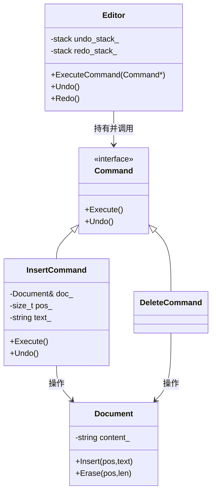
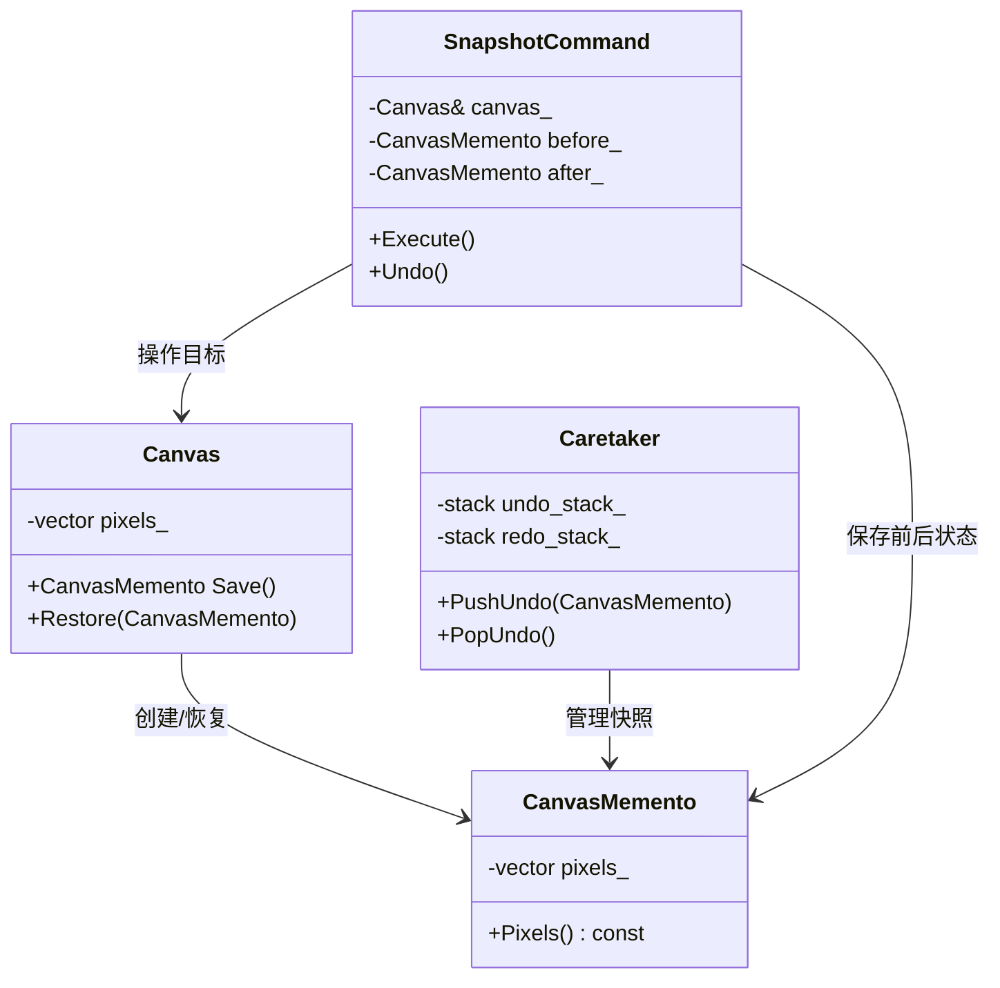

# 撤销与恢复功能设计模式解析

## 1. 背景与目标
在文字编辑器、图形软件、输入法等产品中，撤销（Undo）与恢复（Redo）让用户能像“倒带”和“重播”一样操作历史记录。本指南介绍实现这两个功能常用的两种设计模式：**命令模式（Command Pattern）**与**备忘录模式（Memento Pattern）**，并配合易懂的日常类比与示例代码，帮助初学者建立直观认识。

> 生活类比：想像你写作业，每完成一步就把“怎么做”和“怎么擦掉”写在卡片上。撤销时翻出最后一张卡片照着擦，恢复时再照着写回来。

---

## 2. 命令模式——用“操作卡片”记录一切
命令模式将每一个用户操作封装成独立对象（操作卡片），对象中同时保存“怎么做（执行）”和“怎么反悔（撤销）”。这张卡片可以被压入历史栈，供撤销／恢复使用。

### 2.1 四个核心角色
| 角色 | 类比解释 | 在代码里的常见名称 |
| --- | --- | --- |
| Command（命令接口） | 卡片模板，规定卡片要写什么 | `Command` 抽象基类，声明 `Execute()` 与 `Undo()` |
| Concrete Command（具体命令） | 不同卡片的具体内容 | `InsertCommand`、`DeleteCommand` 等 |
| Receiver（接收者） | 真正干活的对象 | 文档、画布、输入上下文等 |
| Invoker（调用者） | 负责发放卡片、管理栈的管家 | 编辑器或输入引擎 |

### 2.2 执行与撤销的时序
1. 用户在界面上触发操作，Invoker 创建对应命令对象。
2. 命令对象调用 Receiver 执行动作，同时记录撤销所需的信息。
3. 命令被压入 `undo_stack`，以便稍后撤销。
4. 撤销时从 `undo_stack` 取出命令，调用 `Undo()`；命令被压入 `redo_stack`。
5. 恢复时从 `redo_stack` 取出命令，重新 `Execute()`，再放回 `undo_stack`。

### 2.2.1 类图总览


上图展示命令模式中的典型角色：`Command` 是操作卡片的标准接口，各类具体命令（如 `InsertCommand`、`DeleteCommand`）继承它并实现执行/撤销逻辑。`Editor` 负责维护撤销与恢复栈并调用命令，而 `Document` 则是真正被修改的目标对象。

### 2.3 栈结构的工作方式
1. **执行新命令**：
   - 调用 `Execute()`。
   - 把命令放进 `undo_stack`。
   - 清空 `redo_stack`（防止恢复过期操作）。
2. **撤销**：
   - 从 `undo_stack` 取出最新命令，调用 `Undo()`。
   - 将命令放进 `redo_stack`。
3. **恢复**：
   - 从 `redo_stack` 取出命令，调用 `Execute()` 再次执行。
   - 放回 `undo_stack`。

### 2.4 C++ 示例：简化版文本编辑器
下面的代码展示了如何用命令模式实现插入与撤销。注释采用生活语言解释每一步，便于初学者理解。

```cpp
#include <iostream>
#include <memory>
#include <stack>
#include <string>

// Receiver：真正保存文字的对象
class Document {
public:
  void Insert(std::size_t pos, const std::string& text) {
    // 将文字插入指定位置，相当于往作业本里补写内容
    content_.insert(pos, text);
  }

  void Erase(std::size_t pos, std::size_t len) {
    // 删除一段文字，就像用橡皮擦掉
    content_.erase(pos, len);
  }

  const std::string& GetContent() const { return content_; }

private:
  std::string content_;
};

// Command：标准卡片模板
class Command {
public:
  virtual ~Command() = default;
  virtual void Execute() = 0;  // 正向执行
  virtual void Undo() = 0;      // 反向撤销
};

// 具体命令：插入文字
class InsertCommand : public Command {
public:
  InsertCommand(Document& doc, std::size_t pos, std::string text)
      : doc_(doc), pos_(pos), text_(std::move(text)) {}

  void Execute() override {
    doc_.Insert(pos_, text_);   // 让文档在 pos_ 插入文字
  }

  void Undo() override {
    doc_.Erase(pos_, text_.size());  // 撤销时擦掉刚插入的文字
  }

private:
  Document& doc_;
  std::size_t pos_;
  std::string text_;
};

// Invoker：管家，负责发放命令并维护栈
class Editor {
public:
  void ExecuteCommand(std::unique_ptr<Command> cmd) {
    cmd->Execute();                     // 先执行正向动作
    undo_stack_.push(std::move(cmd));   // 把命令卡片收进撤销栈
    ClearStack(redo_stack_);            // 新操作后清空恢复栈
  }

  void Undo() {
    if (undo_stack_.empty()) {
      std::cout << "没有可撤销的操作\n";
      return;
    }
    auto cmd = std::move(undo_stack_.top());
    undo_stack_.pop();
    cmd->Undo();                        // 执行卡片上的反悔步骤
    redo_stack_.push(std::move(cmd));   // 反悔完的卡片放进恢复栈
  }

  void Redo() {
    if (redo_stack_.empty()) {
      std::cout << "没有可恢复的操作\n";
      return;
    }
    auto cmd = std::move(redo_stack_.top());
    redo_stack_.pop();
    cmd->Execute();                     // 再次执行正向动作
    undo_stack_.push(std::move(cmd));   // 返回撤销栈继续排队
  }

private:
  template <typename Stack>
  void ClearStack(Stack& s) {
    while (!s.empty()) {
      s.pop();                          // 像把旧卡片全部丢掉
    }
  }

  std::stack<std::unique_ptr<Command>> undo_stack_;
  std::stack<std::unique_ptr<Command>> redo_stack_;
};

int main() {
  Document doc;
  Editor editor;

  editor.ExecuteCommand(std::make_unique<InsertCommand>(doc, 0, "你好"));
  editor.ExecuteCommand(std::make_unique<InsertCommand>(doc, 2, "，世界"));

  std::cout << "当前内容: " << doc.GetContent() << "\n";  // 输出“你好，世界”

  editor.Undo();
  std::cout << "撤销后: " << doc.GetContent() << "\n";    // 输出“你好”

  editor.Redo();
  std::cout << "恢复后: " << doc.GetContent() << "\n";    // 输出“你好，世界”
}
```

### 2.5 延伸能力
1. **命令合并**：多次连续的微小输入可以合并成一张“大卡片”，减少栈深度。
2. **宏命令**：把多张卡片打包，支持批量撤销或重放操作。
3. **持久化历史**：将命令序列保存到磁盘，支持跨会话撤销与操作回放。

---

## 3. 备忘录模式——给状态拍“快照”
当某个操作无法轻松写出“逆向动作”时（例如复杂画布、AI 模型参数），就需要备忘录模式。它把对象状态存成快照，撤销时直接还原。

### 3.1 三个角色
| 角色 | 含义 | 职责 |
| --- | --- | --- |
| Originator（原发器） | 被拍照的对象 | 创建与恢复备忘录 |
| Memento（备忘录） | 状态快照 | 保存需恢复的内部数据 |
| Caretaker（保管员） | 历史管理者 | 保存快照列表，不直接解析内容 |

### 3.1.1 类图总览


类图强调了备忘录模式的三个关键对象：`Canvas` 负责生成与恢复快照、`CanvasMemento` 保存状态，而 `Caretaker` 仅保存快照不解析内容。为了融入撤销/恢复流程，`SnapshotCommand` 同时引用命令模式与备忘录模式，执行时恢复 `after` 快照，撤销时恢复 `before` 快照。

### 3.2 C++ 示例：与命令模式合用
```cpp
// 只展示核心片段
#include <vector>

class CanvasMemento {
public:
  explicit CanvasMemento(std::vector<int> pixels) : pixels_(std::move(pixels)) {}
  const std::vector<int>& Pixels() const { return pixels_; }
private:
  std::vector<int> pixels_;
};

class Canvas {
public:
  CanvasMemento Save() const { return CanvasMemento(pixels_); }  // 拍照
  void Restore(const CanvasMemento& memento) { pixels_ = memento.Pixels(); }  // 还原
  // 其他绘图接口...
private:
  std::vector<int> pixels_;
};

class SnapshotCommand : public Command {
public:
  SnapshotCommand(Canvas& canvas, CanvasMemento before, CanvasMemento after)
      : canvas_(canvas), before_(std::move(before)), after_(std::move(after)) {}
  void Execute() override { canvas_.Restore(after_); }   // 恢复为操作后的快照
  void Undo() override { canvas_.Restore(before_); }      // 回到操作前的快照
private:
  Canvas& canvas_;
  CanvasMemento before_;
  CanvasMemento after_;
};
```
执行复杂绘图命令时，先保存 `before` 快照，再执行绘图并保存 `after`。撤销与恢复时分别套用不同快照，无需手写逆操作逻辑。

### 3.3 组合策略建议
1. **优先使用命令模式**：逆操作清晰、逻辑简单、内存占用小。
2. **必要时引入备忘录**：当操作难以逆推或涉及外部资源时，拍快照最稳妥。
3. **增量快照**：只记录差异数据（例如 Diff），避免大对象每次全量复制。

---

## 4. 常见实现误区
1. **忘记清空恢复栈**：执行新命令后应清除旧的 `redo` 历史，防止“时间线冲突”。
2. **命令对象缺少撤销信息**：务必在创建命令时就保存足够的数据，例如删除操作要记住被删除的内容。
3. **备忘录泄露细节**：Caretaker 只负责保存，不应直接修改快照内部数据，防止破坏封装性。
4. **多线程环境未加锁**：撤销/恢复修改共享状态时要注意线程安全。

---

## 5. 在 librime 中的启发
- 输入法的撤销逻辑可借鉴命令模式：例如符号替换、候选上屏都可封装成命令对象。
- 当候选上下文十分复杂（涉及多段文本、上下文预测结果）时，可在命令内部维护必要的备忘录，确保撤销后一致。
- 命令序列还能用于“操作重放”或“使用行为分析”，为后续产品迭代提供数据支持。

---

## 6. 快速复习卡
1. 撤销/恢复的核心是**两条栈**（undo / redo）。
2. 命令模式把操作写成“正向 + 反向”两个步骤，像双面卡片。
3. 备忘录模式像快照，适合无法逆操作的复杂场景。
4. 两者组合使用，既省内存又保持可靠性。

> 与同伴练习：试着把“删除选中文本”写成命令对象，并给它配上备忘录（保存被删文字），验证撤销是否精准。
